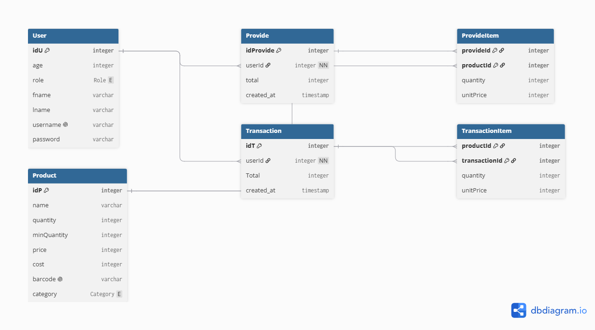

# Inventory_Manager
A web app that let's you handle a stock as an Owner/worker

## Database Model

Here is a full “client-level specification” of the Inventory + Sales System, as if you were going to request it from a developer.

---

# 1. Purpose of the system

A web application that helps a shop owner manage products, track stock, record sales, and understand business performance in real time.

It replaces:

* Paper registers
* Excel sheets
* Manual stock counting

---

# 2. Users of the system

### 1. Owner / Admin

* Full control of everything
* Can add/remove products
* Can see reports and analytics
* Can manage employees

### 2. Employee / Cashier

* Can create sales
* Can view products
* Cannot change prices or delete products

---

# 3. Main features

## A. Product management (inventory catalog)

Each product has:

* Name
* Category (e.g. drinks, food, electronics)
* Selling price
* Cost price (optional but useful)
* Stock quantity
* Barcode / reference code (optional)
* Minimum stock level (alert threshold)

What the user can do:

* Add new products
* Edit product details
* Remove products
* Search and filter products
* See stock status (in stock / low stock / out of stock)

---

## B. Stock tracking (very important part)

The system continuously tracks how products move:

Stock increases when:

* New delivery arrives (restock)

Stock decreases when:

* A sale is made

The system should:

* Never allow selling more than available stock
* Show warnings when stock is low
* Keep a history of all stock changes

---

## C. Sales system (cash register simulation)

A sale works like this:

* Employee selects products
* Chooses quantity
* System calculates total price automatically
* Customer pays (cash or card conceptually)
* Sale is confirmed

After confirmation:

* Stock is automatically updated
* Sale is saved in history

Each sale includes:

* List of products sold
* Quantity per product
* Total price
* Date and time
* Employee who made the sale

---

## D. Sales history

The system keeps all past transactions:

* View all sales
* Filter by date (today, week, month)
* Filter by employee
* Search by product or customer (optional)

Each sale can be opened to see full details.

---

## E. Dashboard (business overview)

A main page that gives a quick summary:

Daily view:

* Total sales today
* Total revenue today
* Number of transactions

Monthly view:

* Total revenue
* Best selling products
* Worst selling products

Stock alerts:

* Products that are low
* Products out of stock

---

## F. Alerts system

The system automatically warns the user when:

* A product is below minimum stock
* A product is completely out of stock

These alerts appear in the dashboard.

---

## G. Employee management (optional but useful)

Admin can:

* Add employees
* Assign roles (cashier, manager)
* Activate/deactivate accounts

Each employee:

* Has login credentials
* Has restricted permissions

---

## H. Search and filtering

The system allows:

* Search products by name
* Filter by category
* Filter by stock level
* Search sales by date or product

---

## I. Reports (simple analytics)

The system can generate:

* Daily report
* Monthly report
* Product performance report

Example:

* “Top 5 best-selling products this month”
* “Total revenue this week”
* “Products with lowest sales”

---

# 4. User experience (how it should feel)

### Simple flow for cashier:

1. Login
2. Open “New Sale”
3. Select products
4. Confirm payment
5. Done

### Simple flow for owner:

1. Login
2. Check dashboard
3. See sales + alerts
4. Manage stock if needed

---

# 5. Important rules of the system

* Stock can never go negative
* Every sale must reduce stock automatically
* Every change must be recorded (traceability)
* Only authorized users can modify product data
* System should be fast for daily use (like a real cash register)

---

# 6. Example real-life scenario

A shop sells drinks:

1. You add “Cola” with 50 units
2. A customer buys 3 bottles
3. System reduces stock to 47 automatically
4. Later stock reaches 5 → system warns “low stock”
5. Owner buys new stock → adds +100 units
6. System updates inventory history

---

